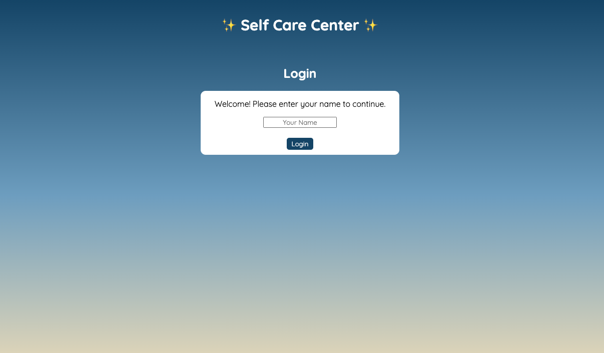
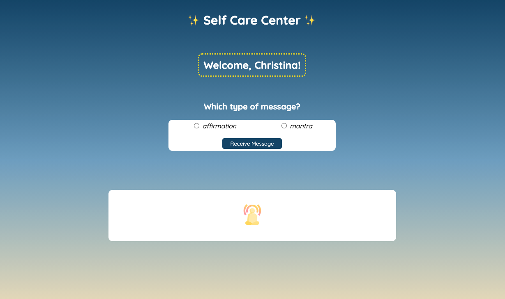
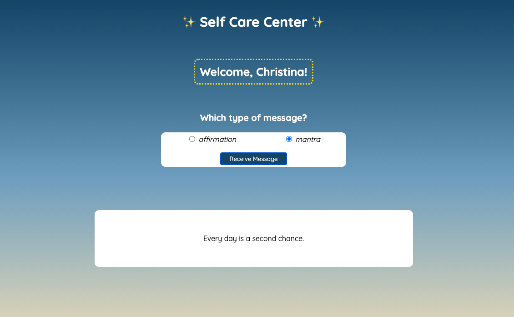

# Self Care Center

## Overview
Self Care Center is an app that helps users remind themselves of their inherent value by giving them positive affirmations and mantras they can use in their daily lives.

**Contributors:**
- @christina-cook

**Technologies Used:**
- HTML
- CSS
- JavaScript

**Deploy Link:** [https://christina-cook.github.io/self-care-center/] (https://christina-cook.github.io/self-care-center/)

## Using Self Care Center
To use the Self Care Center app, follow these steps:

1. When the app loads, you will be greeted with a login page. All you need to do to login is type your first name in the box and click `Login`.

2. Upon logging in, you will be taken to the main page of the app and be greeted with a personalized welcome message at the top of the page. NOTE: You will not receive a personalized welcome message if you do not enter your name on the login page.

3. From the main page, you have the option to choose the type of message you'd like to receive: either an affirmation (thoughts of positive self-empowerment) or a mantra (a phrase that can be repeated again and again during your mindfulness practice

4. Once you've made your selection, click `Receive Message` to display a message in the box below.

5. You can repeat steps 3 and 4 as many times as you'd like until you find a message that resonates with you.

6. It's as simple as that! You can now read, repeat, and practice your affirmations and mantras daily. Enjoy!
